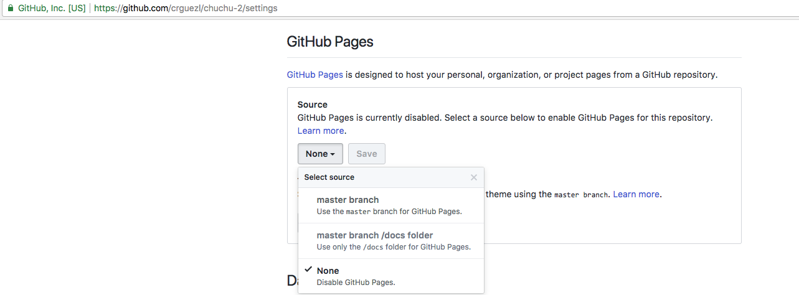

* [Apuntes de Markdown y GitBook](https://casianorodriguezleon.gitbooks.io/elaboracion-de-material-docente-con-gitbook/content/) En Gitbook
* [Apuntes de Markdown y GitBook](https://ull-pfpdi-gitbook-1617.github.io/Elaboracion-de-Material-Docente-con-GitBook/) En GitHub

### Notas

Cuando se despliega un libro gitbook en las GitHub Pages
yo suelo hacerlo así:

1. Crear un fichero `nojekyll` para inhibir el uso de `jekyll`
```bash
~/GitBook/Library/Import/curso-gihub(master)]$ ls -l .nojekyll 
-rw-r--r--  1 casiano  staff  0 17 nov 15:02 .nojekyll
```
2. Añadir el directorio/carpeta con los HTML generados  `_book/`  al repo
```bash
[~/GitBook/Library/Import/curso-gihub(master)]$ git add _book
```
3. Configurar el repo remoto en GitHub para que las páginas se sirvan desde la rama `master` (settings del repo, seccion gh-pages)

4. Poner en la raíz del repo un fichero `index.html` que redirige a `_book/index.html` como este:
  ```html
	<!DOCTYPE HTML>
	<html lang="en-US">
			<head>
					<meta charset="UTF-8">
					<meta http-equiv="refresh" content="1; url=_book/">
					<script type="text/javascript">
							window.location.href = "_book/"
					</script>
					<title>Page Redirection</title>
			</head>
			<body>
					<!-- Note: don't tell people to `click` the link, just tell them that it is a link. -->
					If you are not redirected automatically, follow this <a href='_book/'>link to the book</a>.
			</body>
	</html>
  ```
